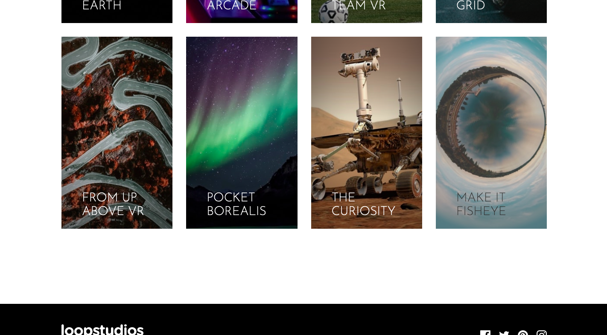

# Frontend Mentor - Loopstudios landing page solution

This is a solution to the [Loopstudios landing page challenge on Frontend Mentor](https://www.frontendmentor.io/challenges/loopstudios-landing-page-N88J5Onjw). Frontend Mentor challenges help you improve your coding skills by building realistic projects. 

## Table of contents

- [Overview](#overview)
  - [The challenge](#the-challenge)
  - [Screenshot](#screenshot)
  - [Links](#links)
- [My process](#my-process)
  - [Built with](#built-with)
  - [What I learned](#what-i-learned)
  - [Continued development](#continued-development)
  - [Useful resources](#useful-resources)
- [Author](#author)

## Overview

### The challenge

Users should be able to:

- View the optimal layout for the site depending on their device's screen size
- See hover states for all interactive elements on the page

### Screenshot

### Links

- Solution URL: [https://github.com/alvarozama/Loopstudios-landing-page]
- Live Site URL: [https://alvarozama.github.io/Loopstudios-landing-page/]

## My process

### Built with

- Semantic HTML5 markup
- CSS custom properties
- Flexbox
- CSS Grid
- Mobile-first workflow
- BEM methodology
- SCSS - Preprocessor Scripting Language for CSS

### What I learned

One of the mai things I learned from this challenge was the use of the BEM Methodology for CSS, which, as I found, made the styling and selecting of elements much more organized than with raw CSS selectors. Additionally, I used SCSS for the first time and doing so was very helpful in implementing the BEM methodology. 

### Continued development

Since I feel like I abused nesting via the pairing of BEM and SCSS, I'd like to further learn if such a thing is a good or bad practice and how I could improve my code and my markup.

### Useful resources

- [How to use CSS pseudo classes to build a border hover animation](https://www.csshero.org/how-to-use-css-pseudo-classes-to-build-a-border-hover-animation/) - This helped me add hover states similar to the ones shown in the challenge design through the use of pseudo-elements on CSS.
- [Sass Crash Course](https://www.youtube.com/watch?v=nu5mdN2JIwM&list=PLkkUzJo2dDQgNJgUvexOzePB7cpL89Kwa&index=35&t=1034s&ab_channel=TraversyMedia) - This video was very helpful in showing how to set up SCSS/SASS and how to use it.

## Author

- Frontend Mentor - [@alvarozama](https://www.frontendmentor.io/profile/alvarozama)

